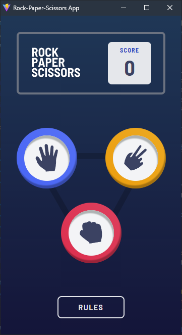
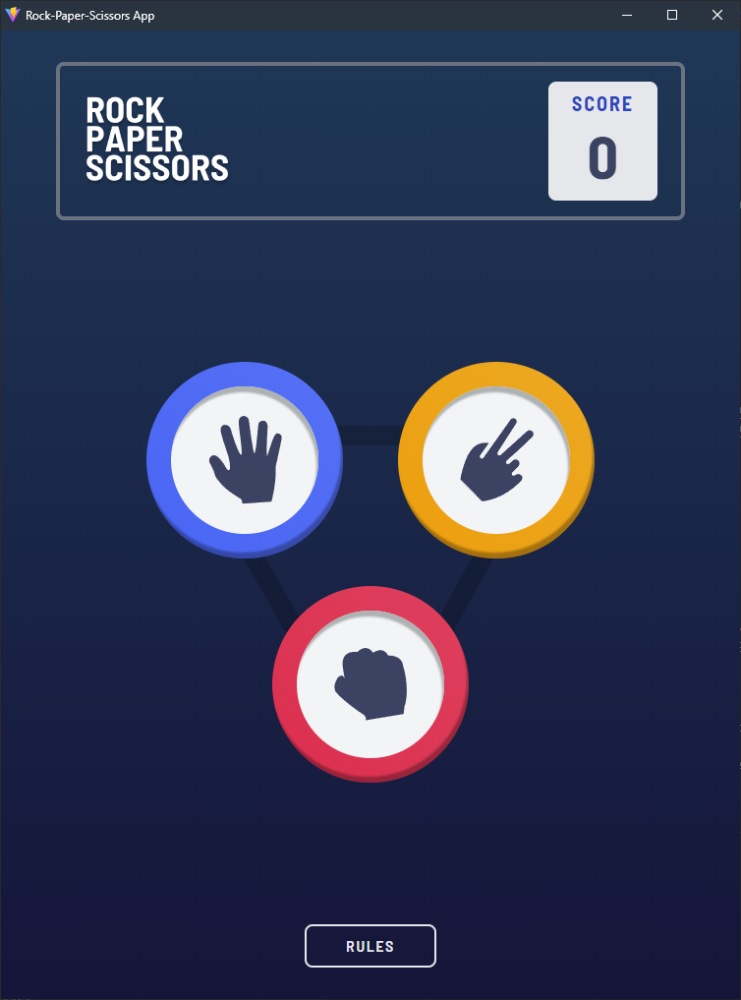

## Table of contents

- [Overview](#overview)
  - [The challenge](#the-challenge)
  - [Screenshot](#screenshot)
  - [Links](#links)
- [My process](#my-process)
  - [Built with](#built-with)
  - [What I learned](#what-i-learned)
  - [Continued development](#continued-development)
  - [Useful resources](#useful-resources)
- [Author](#author)

## Overview

### The challenge

Users should be able to:
- play Rock-Paper-Scissors game
- view responsive design based on their screen size
- keep track of the score
- get +1 score for winning, -1 for losing and 0.5 for tie game

### Screenshot

### Links

- Solution URL: [Github](https://github.com/ppk-1996/rock-paper-scissors-app)
- Live Site URL: [Add live site URL here](https://calculator-app-lyart.vercel.app/)

## My process

### Built with

- Semantic HTML5 markup
- CSS custom properties
- Flexbox
- [React](https://reactjs.org/) - JS library
- [TypeScript](https://www.typescriptlang.org/) - JS with syntax for types
- [Tailwind](https://tailwindcss.com/) - CSS framework
- [React Modal](https://www.npmjs.com/package/react-modal) - React Modal

### What I learned

- mobile and desktop have different arrangment in html elements so I use different components for each screen.

### Continued development
- Bonus part
- Rules modal is not responsive if the screen size is changed while the modal is open.

### Useful resources

- Google

## Author

- Website - [Pyae Phyo Kyaw](https://www.sudohex.com)
- Frontend Mentor - [@ppk-1996](https://www.frontendmentor.io/profile/ppk-1996)
